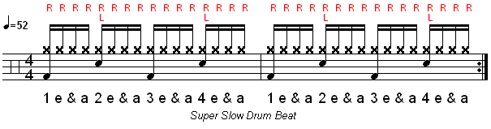

# syncopython
A python module for rhythm production.
Read about the development process [here](https://syncopython.blog/).

## Installation
Syncopython was developed and tested in.
See how to get all dependencies set for sound [here](https://github.com/ndtallant/syncopython/blob/master/get_sound.md).

Install dependent Python packages by running:

```
pip3 install -r requirements.txt
```

from the top level directory (preferably in a virtual environment).

## Python Modules

* attrs
* pluggy
* pytest
* python-rtmidi
* rtmidi
* six
* [prompt-toolkit](https://python-prompt-toolkit.readthedocs.io/en/master/index.html)
* [docopt](http://docopt.org/)   

## Functionality
Syncopython is an interactive shell application with two distinct modes.  

#### 1. Freestyle Mode
This mode prompts the user to create a single bar drum beat using [standard counting](#notation), which is played through the speakers as a live-loop. The user can then update the drumbeat in real time.

##### Developer To-do
1. ~~Have prompt take in notation and play the beat back.~~
2. Have the user be able to update beat through prompt.
    - Find a way for MidiOut class to run without overtaking the shell.
    - Have sequencer know when to quit and be replaced with new one.
3. Have a second pane to display output (general output for now, nothing fancy)
    - Bonus: output in MusicXML

#### 2. Song Mode
This mode allows the user to create a song by first prompting for the form of the song in sections (Example: ABAB), and then prompts the user for each bar in the section.

##### Developer To-do
1. ~~Have prompt take in notation and play the beat back.~~
2. Have the sequencer know when to stop at the end of a section.
3. Have control flow queue up sections to the sequencer correctly.
4. Have a second pane to display output specific to section.
    - Bonus: output full song in MusicXML

#### Current Feature Limitations
Each beat is limited to the 4/4 time signature with a single dynamic (Currently prioritizing different volume levels set for each instrument by default, rather than letting the user change them). Also the user is limited to the same instrumentation of Kick, Snare, and Hi-Hat. While it is certainly possible to change the patch of RhythmString objects internally. Changing the instrumentation inside the shell application is too much of a headache.

## Notation
The user is only responsible for notating the rhythm - sound patches and instrument labels are handled internally.
Rhythmic notation is simply the universal counting system, with each beat separated by a comma. For example, straight eighth notes would be:

```
1&,2&,3&,4&
```

And the following prompt would result in a basic drum beat (shown below):

```
Hi-Hat: 1&,2&,3&,4&
Snare:    ,2 ,  ,4
Kick:   1 ,  ,3 ,
```


Sixteenth notes can also be notated with standard counting:


The prompt for that beat would be:

```
Hi-Hat: 1e&a,2e&a,3e&a,4e&a
Snare:    ,2 ,  ,4
Kick:   1 ,  ,3 ,


### Other To-Do
Make soft synth level configurable in VM - or see what the default setting is

Contribute
----------
- [Submit an Issue](https://github.com/ndtallant/syncopython/issues)
- [Source Code](https://github.com/ndtallant/syncopython)
