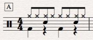

# syncopython
Hey there, this was a fun project for intuitive rhythm production (basically a case study of an adapter design pattern). Read about the development process [here](https://syncopython.blog/).

## Installation
Syncopython was developed and tested in Ubuntu 16.04 xenial. Getting required sound dependencies (kernel settings, softsynths, MIDI, etc.) is quite extensive and can be found [here](https://github.com/ndtallant/syncopython/blob/master/get_sound.md).

Install dependent python packages by running `pip3 install -r requirements.txt` from the top level directory. 

## Using the Shell Application. 
Syncopython is an interactive shell application for creating and playing drum beats. The API gives the following commands  

- Examples: Prints a sample input flow.
- Add Instrument: Prompts the user to add either a Kick, Snare, or Hi-Hat (with a rhythm)
- Delete Instrument: Prompts the user to delete an instrument from their kit. 
- Change Instrument: Prompts the user to change the rhythm of an instrument on the kit. 
- play: Plays the drumbeat through the speakers (or chosen MIDI port).
- exit: Exits syncopython

#### Feature Limitations
Each beat is limited to a single dynamic and a minimum subdivision of 16th notes (no triplets). Also the user is limited to the same instrumentation of Kick, Snare, and Hi-Hat. Different sets of patches are implemented internally, but cannot be accessed through the API. The sound difference with general MIDI was not enough to explore this further.

## Notation
The user is only responsible for notating the rhythm - sound patches and instrument labels are handled internally.
Rhythmic notation is simply the universal counting system, with each beat separated by a comma. For example, straight eighth notes would be:

```
1&,2&,3&,4&
```

And the following prompt would result in a basic drum beat (shown below):

```
Hi-Hat: 1&,2&,3&,4&
Snare:    ,2 ,  ,4
Kick:   1 ,  ,3 ,
```


Sixteenth notes can also be notated with standard counting:


The prompt for that beat would be:

```
Hi-Hat: 1e&a,2e&a,3e&a,4e&a
Snare:      ,2   ,    ,4
Kick:   1   ,    ,3   ,
```
Note syncopython ignores white space!

Contribute
----------
- [Submit an Issue](https://github.com/ndtallant/syncopython/issues)
- [Source Code](https://github.com/ndtallant/syncopython)
